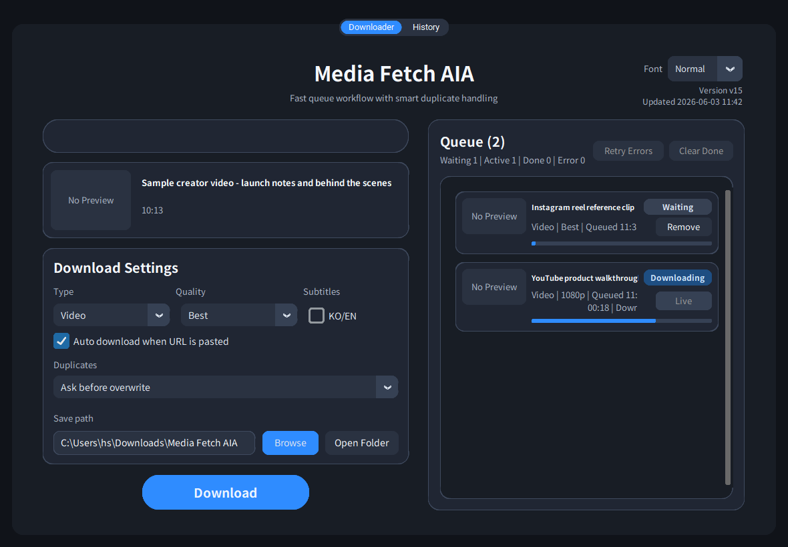
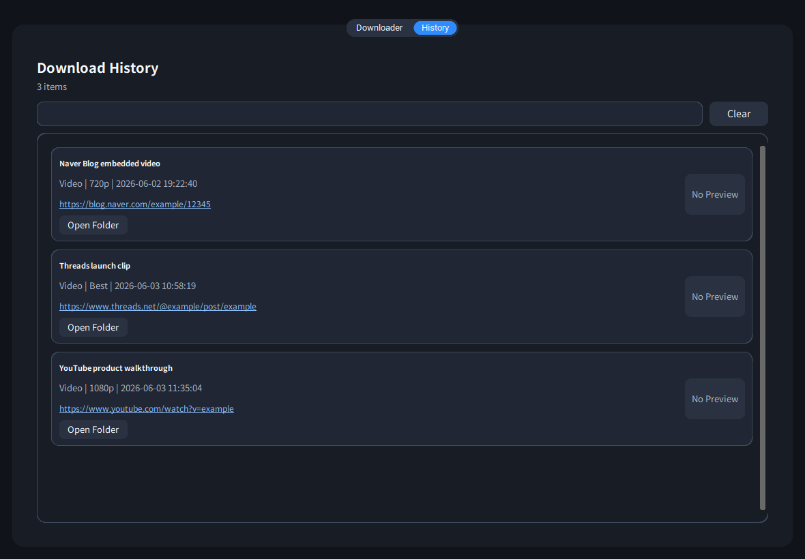

# Media Fetch AIA

Media Fetch AIA is a Windows desktop downloader built on yt-dlp and gallery-dl, focused on practical media download workflows for YouTube, Instagram, Threads, and Naver Blog. It provides a local GUI, queue-based downloads, history, duplicate handling, thumbnails, subtitles, and Windows URL protocol integration.



## Features

- Download media from YouTube, Instagram, Threads, Naver Blog, and other yt-dlp supported URLs.
- Choose video or audio mode, resolution, and subtitle options.
- Queue multiple downloads and monitor progress from the desktop UI.
- Keep local download history with thumbnails and quick file access.
- Handle duplicate files with ask, auto-rename, overwrite, or skip policies.
- Use yt-dlp first, with gallery-dl fallback support for Instagram workflows.
- Register the Windows URL protocol `yg-download://` for quick app handoff.



## Requirements

- Windows
- Python 3.12 for source runs
- ffmpeg available on PATH for the best video merge/conversion support

Install Python dependencies:

```powershell
python -m pip install -r requirements.txt
```

## Run From Source

```powershell
python main.py
```

The app stores settings and history under:

```text
%USERPROFILE%\.media_fetch_aia
```

Older settings from `%USERPROFILE%\.new_youtube_downloader` are copied into the new app folder when available.

The default download folder is:

```text
%USERPROFILE%\Downloads\Media Fetch AIA
```

## Releases

Compiled Windows builds should be distributed through GitHub Releases, not committed to the repository.

The packaged app uses a PyInstaller one-dir layout. When building locally, keep the executable and its `_internal` folder together.

## Build

Check syntax:

```powershell
python -m py_compile gui.py downloader.py main.py
```

Build a release bundle:

```powershell
powershell -ExecutionPolicy Bypass -File .\build_versioned.ps1
```

Build without bumping `VERSION`:

```powershell
powershell -ExecutionPolicy Bypass -File .\build_versioned.ps1 -NoBump
```

See [docs/BUILD_AND_RELEASE.md](docs/BUILD_AND_RELEASE.md) for the full local build flow.

## Documentation

- [Usage Guide](docs/USAGE.md)
- [Build and Release](docs/BUILD_AND_RELEASE.md)
- [FAQ](docs/FAQ.md)

## Notes

- Instagram downloads may require browser cookies depending on the target content.
- Threads URLs are supplemented with internal media metadata when yt-dlp does not support the URL directly.
- Naver Blog videos are resolved from blog page video metadata when possible.
- Respect each platform's terms and only download media you have permission to access.

## License

This project is licensed under the MIT License. See [LICENSE](LICENSE).
